# SOCOTEC Client Data Solution

This repository proposes a practical data strategy and engineering blueprint for SOCOTEC's client-facing data platform, aligned with its TIC (Testing, Inspection, Certification) business and current Data & AI Hub direction.

## 1) Business

### 1.1 Current Business Model (TIC + Data-Driven Services)
- Core business: testing, inspection, certification, and technical advisory services for construction, infrastructure, environment, and safety.
- Value chain: field operations -> measurements/reports -> compliance evidence -> risk reduction recommendations for clients.
- Data opportunity: convert inspection and operations data into recurring digital products (predictive maintenance, risk scoring, compliance dashboards, client APIs).
- Strategic fit: SOCOTEC already operates a global Data & AI Hub and is modernizing an international Lakehouse.

### 1.2 Quick Revenue / Profitability Snapshot (Recent Years)
Based on public SOCOTEC sustainability reports:
- 2023 revenue: EUR 1,308.5M; EBITDA: EUR 223M; EBITDA margin: ~17%.
- 2024 revenue: EUR 1,476.6M; EBITDA: EUR 306.4M; EBITDA margin: ~20.7%.
- YoY trend: strong growth in both top-line and operating profitability, supported by organic growth and acquisitions.

Sources:
- [SOCOTEC Sustainability Report 2023](https://static.socotec.com/s3fs-public/2024-10/190624-en-csr-report-socotec-2023-finaljune24-002_0.pdf)
- [SOCOTEC Sustainability Report 2024](https://static.socotec.co.uk/s3fs-public/2025-06/socotec-group-sustainability-report-2024.pdf)

### 1.3 Potential Assessment
SOCOTEC has high potential to scale data products because:
- Large installed base of industrial/building/infrastructure projects generates defensible proprietary datasets.
- Existing Lakehouse and cloud data capabilities reduce time-to-market for analytics products.
- Demand for compliance automation, cost optimization, predictive maintenance, and ESG reporting is rising.
- GenAI (e.g., Databricks GenIE) can improve self-service insights for client and internal teams.

Overall assessment: **High potential**, especially for monetizable B2B analytics and AI-assisted risk management offerings.

### 1.4 Company Snapshot (Public, ~2025–2026)

| Metric | Value |
|--------|-------|
| Positioning | Global leader in **Testing, Inspection, Certification (TIC)** for construction, infrastructure, and industry |
| Tagline | *Building trust for a safer and sustainable world* |
| Scale | ~**15,000** employees · **250,000** clients · **26** countries |
| Operating model | **Trusted third party** — public and private clients, full project lifecycle (design → operation → decommissioning) |

**Strategic themes (corporate site):** Renewable energy · Sustainability · Smart cities · Industry 4.0 · **BIM & Data**

### 1.5 Service Lines (What SOCOTEC Sells)

| Service line | Typical deliverables | Data relevance |
|--------------|---------------------|----------------|
| **Green Building** | Energy performance, low-carbon trajectories, ESG | Time-series energy, asset benchmarks, carbon KPIs |
| **Technical Inspection & Verification (TIV)** | Regulatory inspections, periodic facility/equipment checks | Inspection events, pass/fail, schedules, evidence |
| **Specialty Engineering** | Structural, geotechnical, envelope, dispute support | Models, measurements, lab results |
| **Failure Analysis** | Root cause, forensic engineering | Case files, sensor logs, reports |
| **Fire & Life Safety** | Testing, certification, building control (e.g. UKTC acquisition) | Compliance results, test certificates |
| **Environment & Safety** | Monitoring, hygiene, water quality, asbestos | Environmental samples, thresholds, alerts |
| **Certification** | ISO / FSSC / GHG verification (strong in APAC hubs) | Audit trails, management-system metadata |
| **Training** | 41 training centres in France alone | LMS data, certification renewals |

### 1.6 Sectors & Client Types

| Sector | Examples | SOCOTEC role |
|--------|----------|--------------|
| **Construction & Real Estate** | Buildings, envelopes, materials testing | Risk reduction before/after handover |
| **Infrastructure** | Roads, dams, rail (e.g. Etihad Rail UAE), ordnance (Germany) | Long-life asset monitoring and safety |
| **Industry & Energy** | Plants, utilities, renewable (Harvard Street solar, dams) | Compliance + performance optimization |
| **Real Estate / Asset owners** | PERIAL energy optimization, property valuations (NL) | Recurring advisory + monitoring contracts |

### 1.7 Product Families: Green Trust & Trust & Tech

**Green Trust** — environmental and structural assurance for sustainable assets:

- **BlueTrust Monitoring** — environmental monitoring (water, air, soil)
- **Optic fibre / structural monitoring** — deformation, structural health
- **Topographic surveys** — geospatial baseline for change detection

**Trust & Tech / BIM & Data** — digital layer on physical inspections:

- BIM-linked asset models and project data
- **Integrated digital platform** (Vietnam Cementys): survey software, real-time monitoring SaaS, ML/AI for infrastructure ageing
- Partnerships: e.g. **FREEDA** (AI architectural plan analysis, Jan 2026)

*DE implication:* Bronze = raw sensor/app/ERP feeds; Silver = conformed assets + time-series; Gold = client KPIs (risk, compliance, freshness, anomaly flags) consumed by monitoring UIs and APIs.

### 1.8 Regional Footprint (Interview Context)

| Region | Note | Scale (public) |
|--------|------|----------------|
| **France** | Group HQ strength; 190 branches, 41 training centres | Leader in TIC risk management |
| **UK & Ireland** | Materials testing, environmental monitoring, acquisitions (LDG, UKTC) | 2,300+ experts, 65 offices |
| **USA** | Building envelope, geotech, commissioning, dispute resolution | 1,700 experts, 40+ offices |
| **Germany** | Building, infrastructure, EOD (Röhll & Koch), geodata (TRIGIS) | 1,500 employees, 38 locations |
| **Spain / BAC** | Civil engineering inspection, labs in Catalonia | 850 employees |
| **Vietnam (Cementys)** | **Structural health monitoring**, environmental services, digital platform | 1 office; ties to global monitoring + Data Hub |
| **UAE** | Mega-projects (Louvre Abu Dhabi, Sea World, DEWA, Etihad Rail) | Third-party design review, MEP, H&S |
| **APAC certification** | Singapore, Japan, Thailand, Philippines — ISO, GHG, concrete/steel cert | Management-system audits |

### 1.9 Vietnam — Cementys & Monitoring (Vu Tran-Viet Round)

SOCOTEC Vietnam operates through **Cementys**, focused on **tech-enabled monitoring** (not generic TIC back-office):

- In-situ measurements: technical assessment, inspections, surveys
- **Structural health monitoring** for transport and energy infrastructure
- Environmental: noise, vibration, water pollution, geotechnical, topography
- **Data visualisation**: proprietary survey/maintenance software, 24/7 on-call monitoring
- **Digital platform**: data science, automated ageing analysis, maintenance SaaS, ML/AI

**What they likely need from a DE:** reliable ingestion of high-frequency sensor streams, asset master alignment, SLA-backed Gold metrics for dashboards/BIM, clear ownership between Massy Data Hub and VN engineering.

### 1.10 Data & AI Hub — Inferred Role Requirements

From public job posts, LinkedIn (e.g. Lead DE Perrine TCHEEKO), and group digital direction:

| Requirement area | Expected depth |
|------------------|----------------|
| **PySpark / SQL** | Aggregates, filters, joins; live coding reported (Glassdoor, Dec 2025) |
| **Lakehouse** | AWS + **Databricks** + **Delta**; Bronze/Silver/Gold; DLT expectations |
| **Orchestration** | Airflow; job triggers, SLA sensors |
| **Governance** | PII/GDPR, Unity Catalog, data contracts, DQ in CI |
| **Product mindset** | Turn inspection/compliance/monitoring data into **client-facing products** (APIs, Power BI, GenAI on Gold only) |
| **Soft signals** | Documentation, teamwork, bilingual hub (FR/EN), production escalation judgment |

**Business pull:** acquisitions (testing labs, monitoring, geodata) increase heterogeneous sources → need standardized Silver entities and governed Gold products.

### 1.11 Business Visuals (Mermaid)
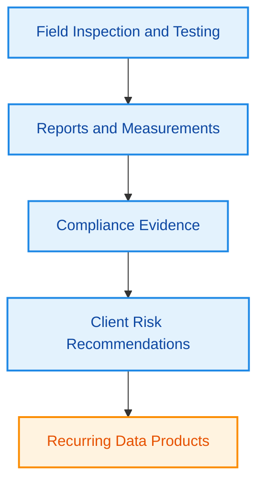

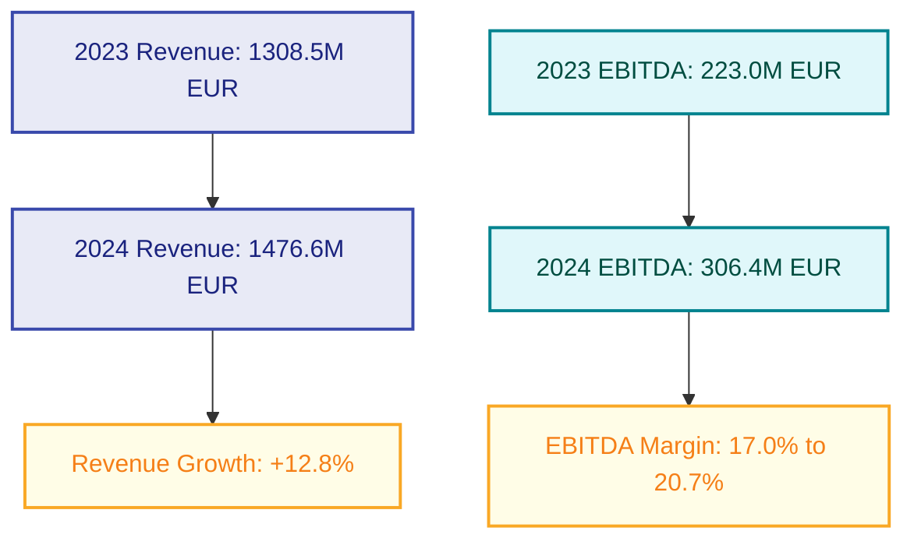

## 2) Architecture

### 2.1 Current Data Solution (Likely Baseline from JD Context)
Current stack direction in job posts and profiles indicates:
- Cloud: AWS-first data platform.
- Lakehouse: Databricks + Delta Lake + S3.
- Ingestion: Fivetran/Airbyte + custom connectors.
- Processing: Spark batch/stream workloads.
- Orchestration: Airflow.
- BI/Serving: Power BI and Databricks SQL.
- Governance/metadata: OpenMetadata style catalog + data quality controls.
- Collaboration: Git/GitLab, notebooks, CI/CD.

### 2.2 Proposed Target Data Solution for Clients
#### A. Ingestion Layer
- Sources: ERP, CRM, IoT sensors, inspection apps, external regulatory/open data.
- Pattern: CDC + batch + event streams (Kafka).
- Contracts: schema registry and source-level data contracts.

#### B. Lakehouse Medallion
- Bronze: immutable raw landing, source lineage, minimal validation.
- Silver: standardized entities (assets, inspections, incidents, work orders) with pseudonymization.
- Gold: domain marts (Asset Health, Compliance KPI, Cost/Risk, ESG, Client SLAs).

#### C. Data Governance & Trust
- Data quality tests (freshness, null checks, referential integrity, business rules).
- PII handling with tokenization/hashing and row/column-level access policy.
- Lineage, ownership, and SLA enforcement integrated in CI/CD.

#### D. Serving & Product Layer
- BI dashboards for business users.
- API/data products for client integration.
- Semantic layer and query acceleration for self-service analytics.
- GenAI assistant (NL-to-SQL + retrieval over certified metrics).

#### E. DataOps/MLOps
- CI/CD for pipelines and SQL models.
- Observability: pipeline health, data incidents, cost monitoring.
- Versioned data products and backward-compatible contracts.

### 2.3 Reference Architecture (Text)
1. Sources -> 2. Ingestion (CDC/Batch/Streaming) -> 3. Bronze (S3/Delta) -> 4. Silver transformations (Spark/dbt) -> 5. Gold marts + feature sets -> 6. Consumption (Power BI, Databricks SQL, APIs, GenAI assistant) -> 7. Governance/Monitoring across all layers.

### 2.4 Architecture Visuals (Mermaid)
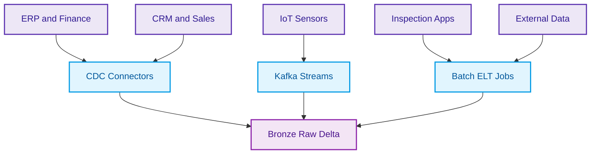

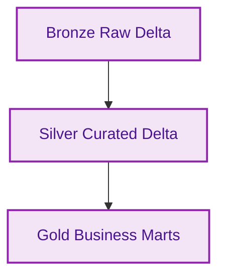

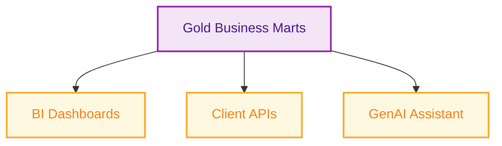

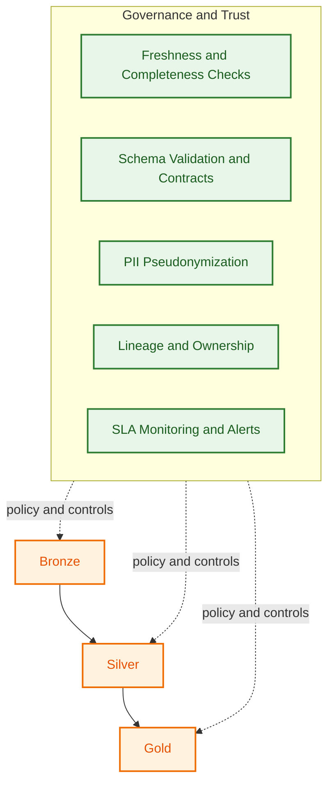

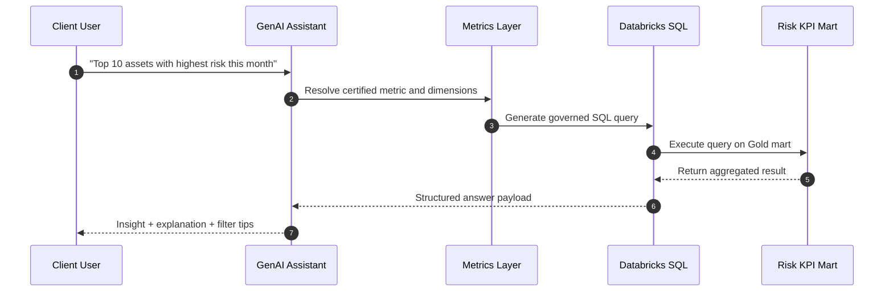

## 3) Engineering Code

### 3.1 Sample of "Current Style" (Typical Spark ETL)
See: `src/current_pipeline.py`
- Simple ingestion + transformation pattern.
- Minimal data quality and no contract enforcement.

### 3.2 Proposed Engineering Code for Target Architecture
See files:
- `src/proposed_dlt_pipeline.py` -> Medallion-style transformation with data quality expectations.
- `src/proposed_data_quality_checks.sql` -> SQL quality checks for Gold marts.
- `src/api_contract_example.json` -> Data product contract for external clients.

### 3.3 Why This Engineering Proposal
- Improves reliability: explicit contracts + quality gates.
- Improves governance: standardized pseudonymization and lineage-ready design.
- Improves business value: reusable data products and faster client analytics delivery.
- Improves scalability: modular pipelines compatible with Databricks, Spark, and CI/CD workflows.

### 3.4 Engineering Delivery Visual (Mermaid)
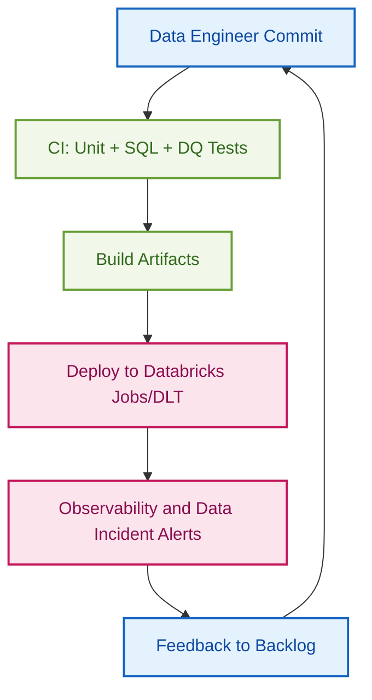

### 3.5 Main File Internals Visuals (Mermaid)

#### A. `src/current_pipeline.py` (`run()` flow)
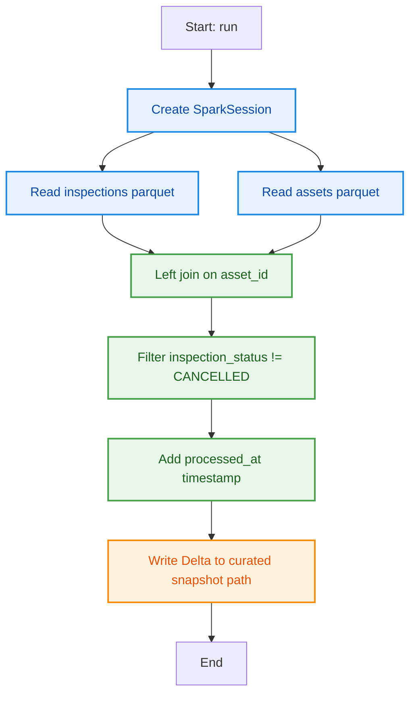

#### B. `src/proposed_dlt_pipeline.py` (DLT tables and methods)
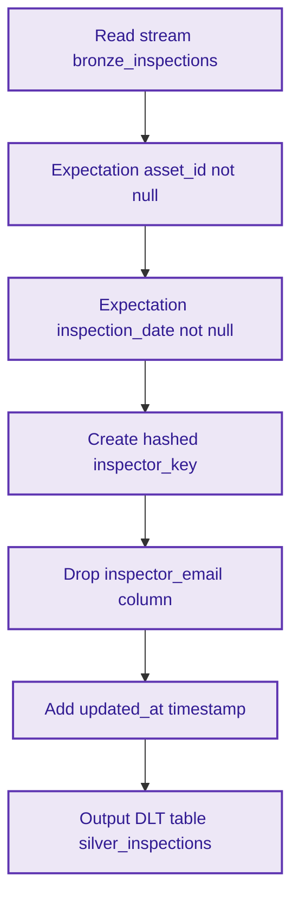

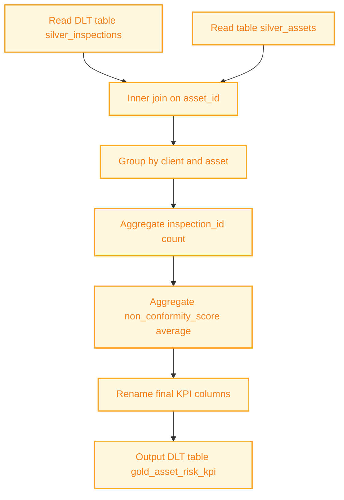

#### C. `src/proposed_data_quality_checks.sql` (query checks)
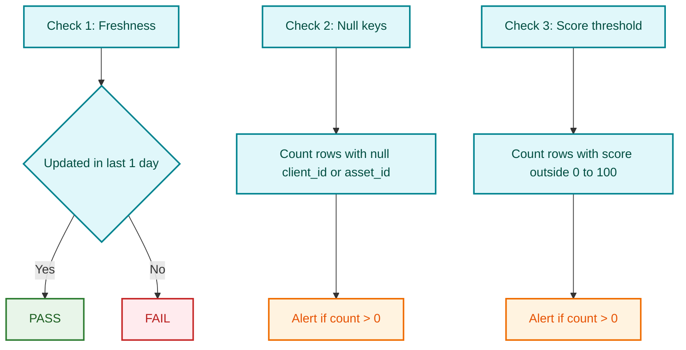

#### D. `src/api_contract_example.json` (contract structure)
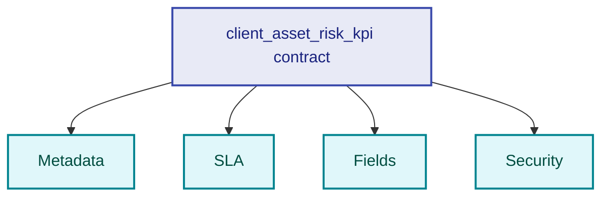

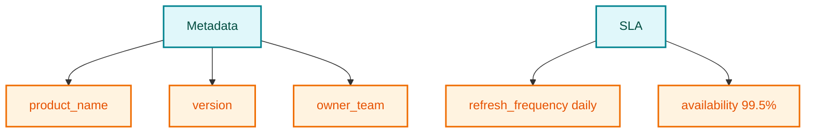

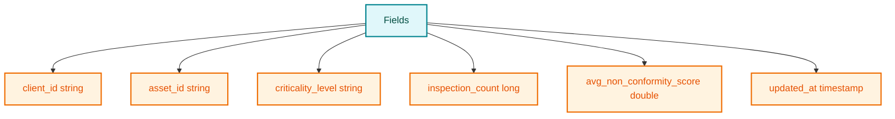

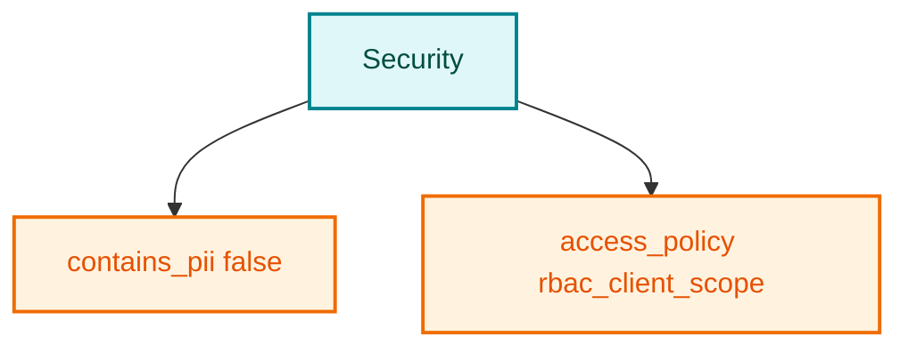

## 4) Data Model (DB Diagram)

This section visualizes the main business entities SOCOTEC can maintain to support client-facing analytics, compliance, and operations.

### 4.1 Core Master Data (Customer, Site, Asset, Inspector)
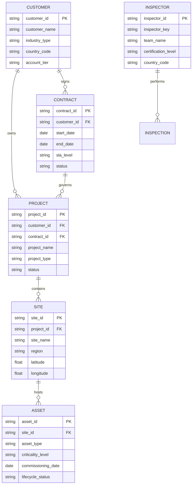

### 4.2 Inspection, Findings, Actions, Compliance
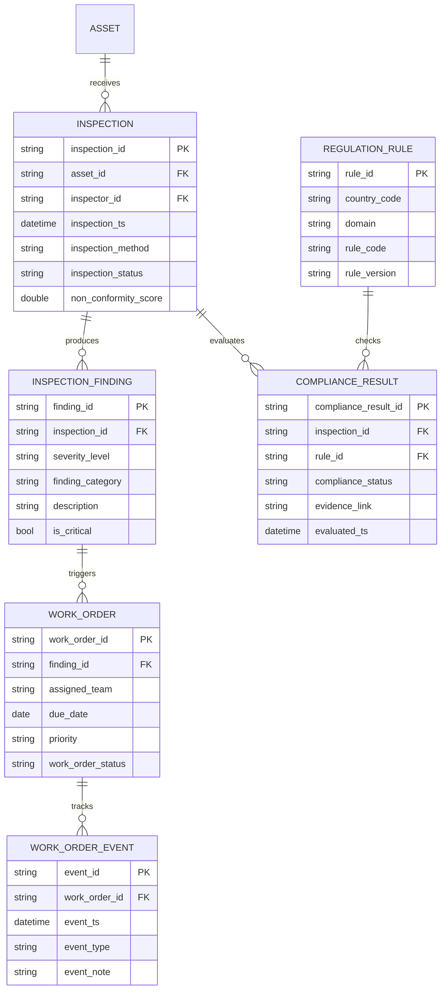

### 4.3 Analytics and Client Reporting Layer
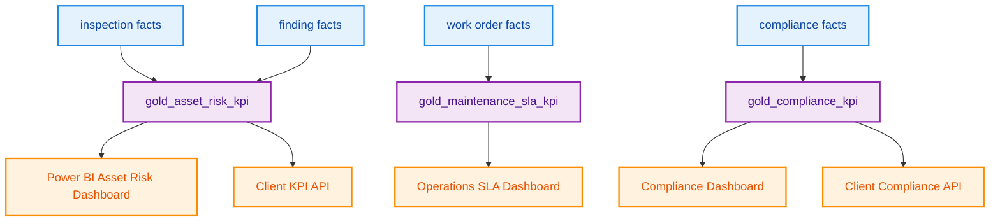

## 5) Interview Prep (Lead DE technical round)

Optional materials for SOCOTEC Data Engineer interview preparation:

| Path | Contents |
|------|----------|
| [`prep/interview-prep.md`](prep/interview-prep.md) | **All-in-one guide** — strategy, **§1.8 business**, **§1.9 friendly French**, cheatsheet, DE + business Q&A, mindmaps |
| [`src/interview_pyspark_example.py`](src/interview_pyspark_example.py) | Live-coding reference (aggregates + filters) |

Reported interview topic (Glassdoor, Dec 2025): **PySpark query with aggregates and filters** — see prep guide §2 Cheatsheet and example file.
