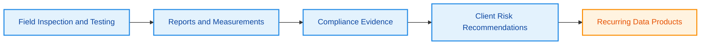
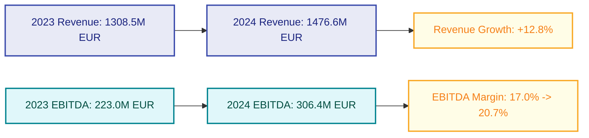
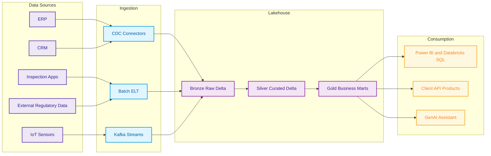
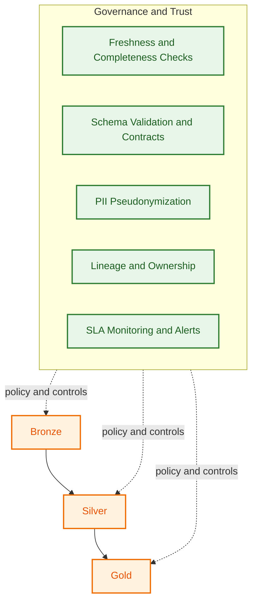
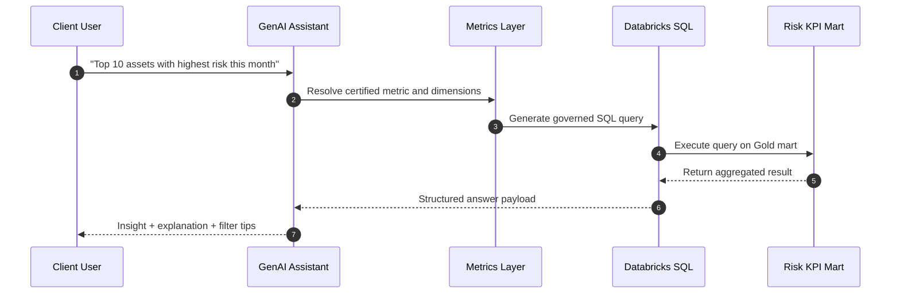
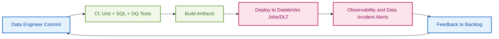

# SOCOTEC Client Data Solution

This repository proposes a practical data strategy and engineering blueprint for SOCOTEC's client-facing data platform, aligned with its TIC (Testing, Inspection, Certification) business and current Data & AI Hub direction.

## 1) Business

### 1.1 Current Business Model (TIC + Data-Driven Services)
- Core business: testing, inspection, certification, and technical advisory services for construction, infrastructure, environment, and safety.
- Value chain: field operations -> measurements/reports -> compliance evidence -> risk reduction recommendations for clients.
- Data opportunity: convert inspection and operations data into recurring digital products (predictive maintenance, risk scoring, compliance dashboards, client APIs).
- Strategic fit: SOCOTEC already operates a global Data & AI Hub and is modernizing an international Lakehouse.

### 1.2 Quick Revenue / Profitability Snapshot (Recent Years)
Based on public SOCOTEC sustainability reports:
- 2023 revenue: EUR 1,308.5M; EBITDA: EUR 223M; EBITDA margin: ~17%.
- 2024 revenue: EUR 1,476.6M; EBITDA: EUR 306.4M; EBITDA margin: ~20.7%.
- YoY trend: strong growth in both top-line and operating profitability, supported by organic growth and acquisitions.

Sources:
- [SOCOTEC Sustainability Report 2023](https://static.socotec.com/s3fs-public/2024-10/190624-en-csr-report-socotec-2023-finaljune24-002_0.pdf)
- [SOCOTEC Sustainability Report 2024](https://static.socotec.co.uk/s3fs-public/2025-06/socotec-group-sustainability-report-2024.pdf)

### 1.3 Potential Assessment
SOCOTEC has high potential to scale data products because:
- Large installed base of industrial/building/infrastructure projects generates defensible proprietary datasets.
- Existing Lakehouse and cloud data capabilities reduce time-to-market for analytics products.
- Demand for compliance automation, cost optimization, predictive maintenance, and ESG reporting is rising.
- GenAI (e.g., Databricks GenIE) can improve self-service insights for client and internal teams.

Overall assessment: **High potential**, especially for monetizable B2B analytics and AI-assisted risk management offerings.

### 1.4 Business Visuals (Mermaid)

## 2) Architecture

### 2.1 Current Data Solution (Likely Baseline from JD Context)
Current stack direction in job posts and profiles indicates:
- Cloud: AWS-first data platform.
- Lakehouse: Databricks + Delta Lake + S3.
- Ingestion: Fivetran/Airbyte + custom connectors.
- Processing: Spark batch/stream workloads.
- Orchestration: Airflow.
- BI/Serving: Power BI and Databricks SQL.
- Governance/metadata: OpenMetadata style catalog + data quality controls.
- Collaboration: Git/GitLab, notebooks, CI/CD.

### 2.2 Proposed Target Data Solution for Clients
#### A. Ingestion Layer
- Sources: ERP, CRM, IoT sensors, inspection apps, external regulatory/open data.
- Pattern: CDC + batch + event streams (Kafka).
- Contracts: schema registry and source-level data contracts.

#### B. Lakehouse Medallion
- Bronze: immutable raw landing, source lineage, minimal validation.
- Silver: standardized entities (assets, inspections, incidents, work orders) with pseudonymization.
- Gold: domain marts (Asset Health, Compliance KPI, Cost/Risk, ESG, Client SLAs).

#### C. Data Governance & Trust
- Data quality tests (freshness, null checks, referential integrity, business rules).
- PII handling with tokenization/hashing and row/column-level access policy.
- Lineage, ownership, and SLA enforcement integrated in CI/CD.

#### D. Serving & Product Layer
- BI dashboards for business users.
- API/data products for client integration.
- Semantic layer and query acceleration for self-service analytics.
- GenAI assistant (NL-to-SQL + retrieval over certified metrics).

#### E. DataOps/MLOps
- CI/CD for pipelines and SQL models.
- Observability: pipeline health, data incidents, cost monitoring.
- Versioned data products and backward-compatible contracts.

### 2.3 Reference Architecture (Text)
1. Sources -> 2. Ingestion (CDC/Batch/Streaming) -> 3. Bronze (S3/Delta) -> 4. Silver transformations (Spark/dbt) -> 5. Gold marts + feature sets -> 6. Consumption (Power BI, Databricks SQL, APIs, GenAI assistant) -> 7. Governance/Monitoring across all layers.

### 2.4 Architecture Visuals (Mermaid)

## 3) Engineering Code

### 3.1 Sample of "Current Style" (Typical Spark ETL)
See: `src/current_pipeline.py`
- Simple ingestion + transformation pattern.
- Minimal data quality and no contract enforcement.

### 3.2 Proposed Engineering Code for Target Architecture
See files:
- `src/proposed_dlt_pipeline.py` -> Medallion-style transformation with data quality expectations.
- `src/proposed_data_quality_checks.sql` -> SQL quality checks for Gold marts.
- `src/api_contract_example.json` -> Data product contract for external clients.

### 3.3 Why This Engineering Proposal
- Improves reliability: explicit contracts + quality gates.
- Improves governance: standardized pseudonymization and lineage-ready design.
- Improves business value: reusable data products and faster client analytics delivery.
- Improves scalability: modular pipelines compatible with Databricks, Spark, and CI/CD workflows.

### 3.4 Engineering Delivery Visual (Mermaid)

