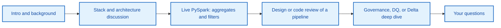
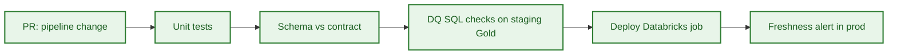

# SOCOTEC DE technical interview — Lead DE round

> **Audience:** Lead Data Engineer interviewer at SOCOTEC Data & AI Hub (Massy, Ile-de-France).  
> **Case study repo:** [`../README.md`](../README.md) · Code samples: [`../src/`](../src/)  
> **Reported topic (Glassdoor, Dec 2025):** PySpark query with aggregates and filters.

**Contents**

| Section | What's inside |
|---------|---------------|
| [1. Strategy](#1-strategy) | Signals, opening pitch, repo walkthrough, interview flow, 30-min drill |
| [2. Cheatsheet](#2-cheatsheet) | Stack, syntax, patterns — skim before the call |
| [3. Technical Q&A](#3-technical-qa) | Full model answers for Lead DE depth |
| [4. Questions to ask](#4-questions-to-ask-the-lead-de) | Pick 2–3 for the end |

Live-coding code file: [`src/interview_pyspark_example.py`](../src/interview_pyspark_example.py)

---

## 1. Strategy

### 1.1 Signals the Lead DE looks for

| Signal | How to demonstrate |
|--------|-------------------|
| **PySpark fluency** | Write clean aggregates + filters on inspection/asset data without IDE autocomplete |
| **Production mindset** | Mention DQ gates, idempotency, backfill, SLA, cost — not just "make it work" |
| **Lakehouse literacy** | Bronze/Silver/Gold, Delta, DLT expectations, merge vs overwrite trade-offs |
| **Governance awareness** | PII pseudonymization, data contracts, client-scoped RBAC |
| **Business framing** | Tie answers to TIC value chain: inspections → compliance → client risk KPIs |
| **Senior judgment** | Trade-offs, when to stop perfecting, how you'd mentor a mid-level DE |

**Core message:** You understand SOCOTEC's stack (AWS + Databricks + Delta + Airflow) and can move their inspection/compliance data from raw landing to governed client-facing products.

### 1.2 Opening pitch (60 seconds)

> I'm a data engineer focused on lakehouse platforms — Spark, Delta Lake, and medallion pipelines on AWS. I've studied SOCOTEC's TIC business and Data & AI Hub direction: turning field inspection and compliance data into recurring analytics products — asset risk KPIs, compliance dashboards, client APIs.  
>  
> This repo is my working blueprint: a current-style Spark ETL, a proposed DLT pipeline with quality expectations, Gold-layer SQL checks, and an API contract example. I'm ready to go deep on PySpark, pipeline design, and how we'd harden this for production at SOCOTEC scale.

### 1.3 How to use this repo in the interview

| If they ask… | Point to… |
|--------------|-----------|
| "Walk me through your understanding of our data platform" | README §2 Architecture + §1 Business |
| "What's wrong with a simple ETL?" | `src/current_pipeline.py` — no DQ, left join fan-out risk, overwrite mode, no PII handling |
| "How would you improve it?" | `src/proposed_dlt_pipeline.py` — expectations, pseudonymization, Gold aggregation |
| "How do you validate Gold tables?" | `src/proposed_data_quality_checks.sql` |
| "How do external clients consume data?" | `src/api_contract_example.json` |
| Live PySpark coding | `src/interview_pyspark_example.py` + [Cheatsheet § PySpark](#pyspark--aggregates-and-filters-interview-pattern) |

### 1.4 Likely interview flow



**Time split (typical 45–60 min technical):** ~15 min discussion · ~20 min live coding · ~15 min design/review · ~5 min your questions.

### 1.5 Before the call — 30-minute drill

1. **Skim** [§2 Cheatsheet](#2-cheatsheet) once (10 min).
2. **Write from memory** the PySpark example in `src/interview_pyspark_example.py` on paper or a blank notebook (10 min).
3. **Explain aloud** why `current_pipeline.py` is insufficient and how DLT fixes it (5 min).
4. **Prepare 3 questions** for the Lead DE ([§4](#4-questions-to-ask-the-lead-de)).

---

## 2. Cheatsheet

### SOCOTEC stack (from JD / public profiles)

| Layer | Tech |
|-------|------|
| Cloud | AWS (S3, IAM, likely MWAA or self-hosted Airflow) |
| Lakehouse | Databricks + Delta Lake |
| Ingestion | Fivetran / Airbyte, CDC, Kafka |
| Processing | PySpark batch + Structured Streaming |
| Orchestration | Airflow |
| BI / SQL | Power BI, Databricks SQL |
| Governance | OpenMetadata-style catalog, DQ, Unity Catalog |
| DevOps | Git/GitLab, CI/CD, notebooks |

### TIC business — 15-second context

Testing, Inspection, Certification for construction / infrastructure / environment. Data opportunity: turn inspection + compliance data into **client analytics products** (risk KPIs, compliance APIs, ESG, predictive maintenance). SOCOTEC runs a global **Data & AI Hub** and an international Lakehouse modernization.

### Medallion layers

```
Sources → Bronze (raw Delta) → Silver (conformed, PII-safe) → Gold (KPIs, APIs) → BI / API / GenAI
```

| Layer | Write pattern | Quality |
|-------|---------------|---------|
| Bronze | Append | Minimal — schema drift OK |
| Silver | Merge / DLT stream | Expectations, typing, dedup |
| Gold | Merge upsert | Contract + SQL DQ + SLA |

### PySpark — aggregates and filters (interview pattern)

```python
from pyspark.sql.functions import col, count, avg, sum, max, min, countDistinct
from pyspark.sql.functions import current_date, date_sub, when, lit

# Filter
df.filter((col("status") != "CANCELLED") & col("score").isNotNull())

# Multiple conditions
df.filter(col("criticality_level").isin("HIGH", "CRITICAL"))

# Date window
df.filter(col("inspection_date") >= date_sub(current_date(), 90))

# Join (prefer filter-before-join)
df.join(other, on="asset_id", how="inner")

# Aggregate
df.groupBy("client_id", "asset_id").agg(
    count("inspection_id").alias("inspection_count"),
    avg("non_conformity_score").alias("avg_score"),
    max("inspection_date").alias("last_inspection"),
)

# Post-agg filter
.filter(col("inspection_count") >= 2)

# Conditional column
.withColumn("risk_band", when(col("avg_score") >= 70, "HIGH").otherwise("LOW"))

# Order
.orderBy(col("avg_score").desc())
```

**Imports to remember:** `col`, `count`, `avg`, `countDistinct`, `sum`, `max`, `min`, `when`, `lit`, `current_date`, `date_sub`, `sha2`, `concat_ws`, `current_timestamp`.

### PySpark — window functions (common follow-up)

```python
from pyspark.sql.window import Window
from pyspark.sql.functions import row_number, rank, dense_rank, lag

w = Window.partitionBy("client_id").orderBy(col("inspection_date").desc())

df.withColumn("rn", row_number().over(w)).filter(col("rn") == 1)  # latest per client
```

### Delta Lake essentials

```python
# Read / write
df.write.format("delta").mode("append").save(path)
spark.read.format("delta").load(path)

# MERGE (upsert)
from delta.tables import DeltaTable
DeltaTable.forPath(spark, path).alias("t").merge(
    source.alias("s"), "t.client_id = s.client_id AND t.asset_id = s.asset_id"
).whenMatchedUpdateAll().whenNotMatchedInsertAll().execute()

# Time travel
spark.read.format("delta").option("versionAsOf", 5).load(path)

# Optimize
spark.sql("OPTIMIZE delta.`path` ZORDER BY (client_id, asset_id)")
```

### DLT expectations (repo pattern)

```python
@dlt.table(name="silver_inspections")
@dlt.expect_or_drop("valid_asset_id", "asset_id IS NOT NULL")
@dlt.expect_or_drop("valid_inspection_date", "inspection_date IS NOT NULL")
def silver_inspections():
    return spark.readStream.table("bronze_inspections").transform(...)
```

| Decorator | On failure |
|-----------|------------|
| `@dlt.expect` | Metric only |
| `@dlt.expect_or_drop` | Drop row |
| `@dlt.expect_or_fail` | Fail pipeline |

### Gold DQ SQL (repo pattern)

```sql
-- Freshness
SELECT CASE WHEN MAX(updated_at) >= current_timestamp() - INTERVAL 1 DAY
       THEN 'PASS' ELSE 'FAIL' END FROM gold_asset_risk_kpi;

-- Null keys
SELECT COUNT(*) FROM gold_asset_risk_kpi
WHERE client_id IS NULL OR asset_id IS NULL;

-- Range
SELECT COUNT(*) FROM gold_asset_risk_kpi
WHERE avg_non_conformity_score < 0 OR avg_non_conformity_score > 100;
```

### Join cheat sheet

| Type | Result |
|------|--------|
| `inner` | Matched rows only |
| `left` | All left + matched right |
| `left_anti` | Left rows with no match on right |
| `cross` | Cartesian (avoid) |

### Data contract fields (repo)

`product_name`, `version`, `owner_team`, `sla.refresh_frequency`, `sla.availability`, `fields[]`, `security.contains_pii`, `security.access_policy`

### Repo file → interview mapping

| File | Talking point |
|------|---------------|
| `current_pipeline.py` | POC ETL — overwrite, no DQ, no PII |
| `proposed_dlt_pipeline.py` | Silver expectations + Gold agg |
| `proposed_data_quality_checks.sql` | Post-publish validation |
| `api_contract_example.json` | Client-facing product spec |
| `interview_pyspark_example.py` | Live coding reference |

### `current_pipeline.py` critique (30 sec)

1. Overwrite → use MERGE for Gold  
2. No DQ gates  
3. Left join without orphan policy  
4. No PII handling  
5. Hard-coded paths → Unity Catalog / config  

### Lead DE phrases (use naturally)

- *"I'd filter before the join to cut shuffle."*
- *"For client-facing Gold, I'd enforce the contract in CI."*
- *"Bronze is immutable; corrections happen in Silver upward."*
- *"I'd MERGE on `(client_id, asset_id)` for idempotent daily refresh."*
- *"DQ CRITICAL blocks publish; MEDIUM opens a ticket."*

### Spark performance — top 5

1. Filter early, select only needed columns  
2. Avoid `collect()` on large datasets  
3. Partition by date / `client_id`  
4. Broadcast small dimension tables (`broadcast(df)`)  
5. Enable AQE on Databricks (default on recent DBR)  

### Entity model (quick)

```
CUSTOMER → PROJECT → SITE → ASSET ← INSPECTION → FINDING → WORK_ORDER
                              ↓
                      COMPLIANCE_RESULT ← REGULATION_RULE
```

Gold marts: `gold_asset_risk_kpi`, `gold_compliance_kpi`, `gold_maintenance_sla_kpi`.

### Pre-interview checklist

- [ ] Write `interview_pyspark_example.py` from memory  
- [ ] Explain Bronze / Silver / Gold with one SOCOTEC example each  
- [ ] Recite 3 DQ checks on Gold  
- [ ] Critique `current_pipeline.py` (5 bullets)  
- [ ] Prepare 2 questions for Lead DE  

---

## 3. Technical Q&A

Answers framed for a **Lead DE** audience: concise, production-oriented, tied to this repo where possible.

### A. Live coding — PySpark

#### Q1. Write a PySpark query with aggregates and filters.

**Context:** Reported real interview question (Glassdoor, SOCOTEC DE, Dec 2025).

**Prompt restatement:** Given inspection and asset tables, compute client/asset risk KPIs with filters and aggregations.

**Model answer (talk track):**

1. Read from **Silver** (validated) tables, not raw Bronze.
2. **Filter** early: drop `CANCELLED`, restrict date window, keep high-criticality assets.
3. **Join** on `asset_id` with `inner` if you only want matched assets (avoids orphan rows).
4. **GroupBy** business keys: `client_id`, `asset_id`, `criticality_level`.
5. **Aggregate:** `count(inspection_id)`, `avg(non_conformity_score)`.
6. **Post-aggregate filter:** e.g. `inspection_count >= 2` for statistical stability.
7. **Order** by risk metric for top-N use cases.

**Code:** see `src/interview_pyspark_example.py`.

```python
recent = inspections.filter(
    (col("inspection_status") != "CANCELLED")
    & (col("inspection_date") >= date_sub(current_date(), 90))
)

kpi = (
    recent.join(assets, on="asset_id", how="inner")
    .filter(col("criticality_level").isin("HIGH", "CRITICAL"))
    .groupBy("client_id", "asset_id", "criticality_level")
    .agg(
        count("inspection_id").alias("inspection_count"),
        avg("non_conformity_score").alias("avg_non_conformity_score"),
    )
    .filter(col("inspection_count") >= 2)
    .orderBy(col("avg_non_conformity_score").desc())
)
```

**Lead-level extras to mention:**

- Push filters before wide joins to reduce shuffle.
- Use explicit `.alias()` instead of default `count(inspection_id)` column names.
- For production Gold, persist to Delta with `merge` keyed on `(client_id, asset_id)` — not daily overwrite.
- Add null guards on score before averaging if source quality is uneven.

---

#### Q2. When do you use `groupBy` + `agg` vs SQL `GROUP BY` in PySpark?

| Approach | Prefer when |
|----------|-------------|
| DataFrame API | Pipeline code, unit tests, DLT/Python notebooks, dynamic column logic |
| Spark SQL | Complex window functions, readable analytics SQL, dbt-style models |

Both compile to the same Catalyst plan. Pick based on team maintainability.

---

#### Q3. Explain join types in the context of inspections ⨝ assets.

| Join | SOCOTEC use case |
|------|------------------|
| **Inner** | Gold KPIs — only assets with at least one inspection |
| **Left** | Audit/reporting — show all assets, flag missing inspections |
| **Left anti** | Data quality — assets with zero inspections in period |

**Repo note:** `current_pipeline.py` uses `left` join but writes a curated snapshot without orphan detection — a gap a Lead would flag.

---

#### Q4. How do you handle skew on `client_id` or `asset_id`?

- Salting hot keys: `concat(col("client_id"), lit("_"), (rand() * num_salts).cast("int")))`.
- Two-phase aggregation: partial agg on salted key, then final agg on real key.
- AQE (Adaptive Query Execution) on Databricks — enable by default on DBR 11+.
- Pre-filter date partitions before groupBy.

---

### B. Databricks, Delta Lake, DLT

#### Q5. Bronze / Silver / Gold — what belongs in each layer at SOCOTEC?

| Layer | Content | SOCOTEC examples |
|-------|---------|------------------|
| **Bronze** | Raw, append-only, source schema + ingest metadata | ERP extracts, inspection app JSON, IoT streams |
| **Silver** | Conformed entities, deduped, pseudonymized, typed | `silver_inspections`, `silver_assets`, `silver_findings` |
| **Gold** | Business KPIs and data products | `gold_asset_risk_kpi`, `gold_compliance_kpi`, client SLA marts |

**Rule:** Gold is narrow and stable; Silver is reusable across domains.

---

#### Q6. What does DLT `@dlt.expect_or_drop` do vs `@dlt.expect`?

| Decorator | Behavior on violation |
|-----------|----------------------|
| `expect` | Record metric, keep row |
| `expect_or_drop` | Drop failing rows |
| `expect_or_fail` | Fail the pipeline update |

**Repo example:** `proposed_dlt_pipeline.py` drops rows with null `asset_id` or `inspection_date` — appropriate for Silver curation.

---

#### Q7. Delta Lake: MERGE vs OVERWRITE for Gold tables?

| Mode | When |
|------|------|
| **Overwrite** | Dev/snapshot rebuilds, idempotent full recompute with partition replace |
| **MERGE (upsert)** | Incremental Gold refresh keyed on `(client_id, asset_id)` |
| **Append** | Bronze event streams, audit logs |

**Lead answer:** `current_pipeline.py` uses overwrite — fine for POC; production Gold should MERGE with `updated_at` tracking and backward-compatible schema evolution.

---

#### Q8. How do you pseudonymize inspector PII in Silver?

**Repo pattern:**

```python
sha2(concat_ws("||", col("inspector_email"), col("country_code")), 256)
```

Then drop `inspector_email`. Mention:

- Salt/pepper stored in secret manager if reversibility is never needed.
- Same input → same hash enables joinability without exposing PII.
- Document in catalog: `inspector_key` is derived, not raw PII.

---

### C. Data quality and governance

#### Q9. What quality checks would you run on `gold_asset_risk_kpi`?

From `proposed_data_quality_checks.sql`:

1. **Freshness** — `MAX(updated_at)` within SLA window (daily → 1 day).
2. **Null keys** — `client_id`, `asset_id` must never be null.
3. **Range** — `avg_non_conformity_score` between 0 and 100.

**Add for Lead depth:**

- Referential integrity: every `asset_id` exists in `silver_assets`.
- Row count anomaly vs 7-day rolling average.
- Duplicate keys on `(client_id, asset_id)`.

---

#### Q10. What is a data contract and why does SOCOTEC need one for client APIs?

A versioned agreement between producer and consumer: schema, SLA, ownership, security.

**Repo example:** `api_contract_example.json` defines fields, refresh frequency, availability, RBAC policy.

**Lead points:**

- Breaking changes require semver bump (`1.0.0` → `2.0.0`).
- CI validates Gold schema against contract before deploy.
- Client-scoped access: `rbac_client_scope` — row filter on `client_id`.

---

#### Q11. How do you integrate DQ into CI/CD?



- dbt tests / Great Expectations / DLT expectations at Silver.
- SQL checks (like repo sample) post-Gold build in staging.
- Block promote on CRITICAL; warn on MEDIUM.

---

### D. Architecture and ingestion

#### Q12. Batch vs streaming for SOCOTEC sources?

| Source | Pattern | Why |
|--------|---------|-----|
| ERP / CRM | Batch or CDC (Fivetran) | Predictable volumes, snapshot correctness |
| Inspection mobile apps | Micro-batch or Kafka → Bronze | Near-real-time ops dashboards |
| IoT sensors | Streaming (Structured Streaming) | High velocity, anomaly detection |

**Medallion stays the same** — streaming lands Bronze; Silver/Gold can be batch or streaming DLT.

---

#### Q13. How would Airflow orchestrate this stack?

- DAG tasks: ingest → trigger Databricks job (DLT or notebook) → run DQ SQL → notify on failure.
- Use `DatabricksSubmitRunOperator` with job clusters or existing all-purpose policy.
- Separate DAGs per domain (inspections vs compliance) with dataset-driven scheduling (Airflow 2.4+).
- SLA sensors on Gold freshness — page if `gold_asset_risk_kpi` stale > 25h.

---

#### Q14. Critique `current_pipeline.py` — what would you change?

| Issue | Fix |
|-------|-----|
| No DQ | DLT expectations or pre-write validation |
| `overwrite` on curated path | Partitioned Delta MERGE |
| Left join without orphan handling | Inner for KPIs; separate DQ report for unmatched |
| No PII treatment | Pseudonymize in Silver |
| No lineage/audit columns | `updated_at`, `_source_file`, `_ingest_ts` |
| Hard-coded S3 paths | Parameterize via config / Unity Catalog volumes |

This is a strong "code review" answer for a Lead round.

---

### E. SOCOTEC business and domain

#### Q15. How does data engineering support SOCOTEC's TIC business?

**Value chain:** field inspection → measurements/reports → compliance evidence → client risk recommendations → **recurring data products**.

**Engineering enablers:**

- Unified asset and inspection master data (Silver).
- Compliance KPI marts tied to regulation rules.
- Client APIs for asset health and ESG reporting.
- GenAI over **certified Gold metrics** (not raw Bronze).

---

#### Q16. Name 2–3 monetizable data products for SOCOTEC clients.

1. **Asset risk dashboard** — `gold_asset_risk_kpi` (inspection frequency, non-conformity trends).
2. **Compliance automation API** — pass/fail against regulation rules with evidence links.
3. **Predictive maintenance signals** — feature store from inspection findings + IoT (MLOps layer).

---

### F. Lead DE — design and behavior

#### Q17. A client reports KPI mismatch vs their internal records. Your process?

1. Confirm contract version and refresh timestamp.
2. Reconcile row counts and key sets (`client_id`, `asset_id`) for the period.
3. Trace lineage: Gold → Silver → Bronze → source extract.
4. Check for filter differences (e.g. they include `CANCELLED`, you exclude).
5. Document root cause; fix pipeline or clarify contract; communicate SLA for correction.

---

#### Q18. How do you balance delivery speed vs governance on a new client onboarding?

- **MVP:** Bronze + thin Silver + one Gold KPI with manual DQ sign-off.
- **Hardening sprint:** contracts, automated DQ, RBAC, backfill playbook.
- Never expose Bronze to clients; never skip PII review for external products.

---

#### Q19. How would you mentor a junior DE on this codebase?

- Pair on one vertical slice: Bronze → Silver for one entity.
- Review PRs for filter-before-join, explicit aliases, test data.
- Have them write one DQ check and one contract field doc before merging Gold change.

---

### G. Quick-fire (short answers)

| Question | Answer |
|----------|--------|
| **Partition Gold by?** | `client_id` + date (or `updated_at` date) for prune and RBAC |
| **Z-order on Delta?** | High-cardinality filter columns: `client_id`, `asset_id` |
| **Unity Catalog role?** | Central governance: schemas, ACLs, lineage, external locations |
| **Idempotent pipeline?** | Deterministic keys + MERGE; ingest dedup on `(source_id, event_ts)` |
| **PII in Gold?** | No — repo contract sets `contains_pii: false` |
| **Power BI connection?** | DirectQuery or Import from Databricks SQL / Gold tables |
| **Cost control on Databricks?** | Job clusters, auto-termination, partition pruning, avoid `collect()` |

---

## 4. Questions to ask the Lead DE

Pick 2–3 — shows senior curiosity without interrogating:

1. *"What is the current split between batch and streaming pipelines in the international Lakehouse?"*
2. *"How does the team enforce data contracts today — CI, DLT expectations, or catalog policies?"*
3. *"What does 'done' look like for a Gold data product before it goes to a client API or Power BI?"*
4. *"Where do you see GenAI (GenIE / NL-to-SQL) fitting vs traditional semantic layers?"*
5. *"What would success look like for this role in the first 90 days?"*
