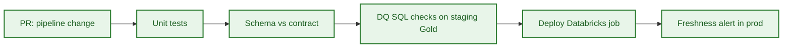

# Technical Q&A — SOCOTEC Lead DE interview

Answers are framed for a **Lead DE** audience: concise, production-oriented, tied to this repo where possible.

---

## A. Live coding — PySpark

### Q1. Write a PySpark query with aggregates and filters.

**Context:** Reported real interview question (Glassdoor, SOCOTEC DE, Dec 2025).

**Prompt restatement:** Given inspection and asset tables, compute client/asset risk KPIs with filters and aggregations.

**Model answer (talk track):**

1. Read from **Silver** (validated) tables, not raw Bronze.
2. **Filter** early: drop `CANCELLED`, restrict date window, keep high-criticality assets.
3. **Join** on `asset_id` with `inner` if you only want matched assets (avoids orphan rows).
4. **GroupBy** business keys: `client_id`, `asset_id`, `criticality_level`.
5. **Aggregate:** `count(inspection_id)`, `avg(non_conformity_score)`.
6. **Post-aggregate filter:** e.g. `inspection_count >= 2` for statistical stability.
7. **Order** by risk metric for top-N use cases.

**Code:** see `src/interview_pyspark_example.py`.

```python
recent = inspections.filter(
    (col("inspection_status") != "CANCELLED")
    & (col("inspection_date") >= date_sub(current_date(), 90))
)

kpi = (
    recent.join(assets, on="asset_id", how="inner")
    .filter(col("criticality_level").isin("HIGH", "CRITICAL"))
    .groupBy("client_id", "asset_id", "criticality_level")
    .agg(
        count("inspection_id").alias("inspection_count"),
        avg("non_conformity_score").alias("avg_non_conformity_score"),
    )
    .filter(col("inspection_count") >= 2)
    .orderBy(col("avg_non_conformity_score").desc())
)
```

**Lead-level extras to mention:**

- Push filters before wide joins to reduce shuffle.
- Use explicit `.alias()` instead of default `count(inspection_id)` column names.
- For production Gold, persist to Delta with `merge` keyed on `(client_id, asset_id)` — not daily overwrite.
- Add null guards on score before averaging if source quality is uneven.

---

### Q2. When do you use `groupBy` + `agg` vs SQL `GROUP BY` in PySpark?

| Approach | Prefer when |
|----------|-------------|
| DataFrame API | Pipeline code, unit tests, DLT/Python notebooks, dynamic column logic |
| Spark SQL | Complex window functions, readable analytics SQL, dbt-style models |

Both compile to the same Catalyst plan. Pick based on team maintainability.

---

### Q3. Explain join types in the context of inspections ⨝ assets.

| Join | SOCOTEC use case |
|------|------------------|
| **Inner** | Gold KPIs — only assets with at least one inspection |
| **Left** | Audit/reporting — show all assets, flag missing inspections |
| **Left anti** | Data quality — assets with zero inspections in period |

**Repo note:** `current_pipeline.py` uses `left` join but writes a curated snapshot without orphan detection — a gap a Lead would flag.

---

### Q4. How do you handle skew on `client_id` or `asset_id`?

- Salting hot keys: `concat(col("client_id"), lit("_"), (rand() * num_salts).cast("int")))`.
- Two-phase aggregation: partial agg on salted key, then final agg on real key.
- AQE (Adaptive Query Execution) on Databricks — enable by default on DBR 11+.
- Pre-filter date partitions before groupBy.

---

## B. Databricks, Delta Lake, DLT

### Q5. Bronze / Silver / Gold — what belongs in each layer at SOCOTEC?

| Layer | Content | SOCOTEC examples |
|-------|---------|------------------|
| **Bronze** | Raw, append-only, source schema + ingest metadata | ERP extracts, inspection app JSON, IoT streams |
| **Silver** | Conformed entities, deduped, pseudonymized, typed | `silver_inspections`, `silver_assets`, `silver_findings` |
| **Gold** | Business KPIs and data products | `gold_asset_risk_kpi`, `gold_compliance_kpi`, client SLA marts |

**Rule:** Gold is narrow and stable; Silver is reusable across domains.

---

### Q6. What does DLT `@dlt.expect_or_drop` do vs `@dlt.expect`?

| Decorator | Behavior on violation |
|-----------|----------------------|
| `expect` | Record metric, keep row |
| `expect_or_drop` | Drop failing rows |
| `expect_or_fail` | Fail the pipeline update |

**Repo example:** `proposed_dlt_pipeline.py` drops rows with null `asset_id` or `inspection_date` — appropriate for Silver curation.

---

### Q7. Delta Lake: MERGE vs OVERWRITE for Gold tables?

| Mode | When |
|------|------|
| **Overwrite** | Dev/snapshot rebuilds, idempotent full recompute with partition replace |
| **MERGE (upsert)** | Incremental Gold refresh keyed on `(client_id, asset_id)` |
| **Append** | Bronze event streams, audit logs |

**Lead answer:** `current_pipeline.py` uses overwrite — fine for POC; production Gold should MERGE with `updated_at` tracking and backward-compatible schema evolution.

---

### Q8. How do you pseudonymize inspector PII in Silver?

**Repo pattern:**

```python
sha2(concat_ws("||", col("inspector_email"), col("country_code")), 256)
```

Then drop `inspector_email`. Mention:

- Salt/pepper stored in secret manager if reversibility is never needed.
- Same input → same hash enables joinability without exposing PII.
- Document in catalog: `inspector_key` is derived, not raw PII.

---

## C. Data quality and governance

### Q9. What quality checks would you run on `gold_asset_risk_kpi`?

From `proposed_data_quality_checks.sql`:

1. **Freshness** — `MAX(updated_at)` within SLA window (daily → 1 day).
2. **Null keys** — `client_id`, `asset_id` must never be null.
3. **Range** — `avg_non_conformity_score` between 0 and 100.

**Add for Lead depth:**

- Referential integrity: every `asset_id` exists in `silver_assets`.
- Row count anomaly vs 7-day rolling average.
- Duplicate keys on `(client_id, asset_id)`.

---

### Q10. What is a data contract and why does SOCOTEC need one for client APIs?

A versioned agreement between producer and consumer: schema, SLA, ownership, security.

**Repo example:** `api_contract_example.json` defines fields, refresh frequency, availability, RBAC policy.

**Lead points:**

- Breaking changes require semver bump (`1.0.0` → `2.0.0`).
- CI validates Gold schema against contract before deploy.
- Client-scoped access: `rbac_client_scope` — row filter on `client_id`.

---

### Q11. How do you integrate DQ into CI/CD?



- dbt tests / Great Expectations / DLT expectations at Silver.
- SQL checks (like repo sample) post-Gold build in staging.
- Block promote on CRITICAL; warn on MEDIUM.

---

## D. Architecture and ingestion

### Q12. Batch vs streaming for SOCOTEC sources?

| Source | Pattern | Why |
|--------|---------|-----|
| ERP / CRM | Batch or CDC (Fivetran) | Predictable volumes, snapshot correctness |
| Inspection mobile apps | Micro-batch or Kafka → Bronze | Near-real-time ops dashboards |
| IoT sensors | Streaming (Structured Streaming) | High velocity, anomaly detection |

**Medallion stays the same** — streaming lands Bronze; Silver/Gold can be batch or streaming DLT.

---

### Q13. How would Airflow orchestrate this stack?

- DAG tasks: ingest → trigger Databricks job (DLT or notebook) → run DQ SQL → notify on failure.
- Use `DatabricksSubmitRunOperator` with job clusters or existing all-purpose policy.
- Separate DAGs per domain (inspections vs compliance) with dataset-driven scheduling (Airflow 2.4+).
- SLA sensors on Gold freshness — page if `gold_asset_risk_kpi` stale > 25h.

---

### Q14. Critique `current_pipeline.py` — what would you change?

| Issue | Fix |
|-------|-----|
| No DQ | DLT expectations or pre-write validation |
| `overwrite` on curated path | Partitioned Delta MERGE |
| Left join without orphan handling | Inner for KPIs; separate DQ report for unmatched |
| No PII treatment | Pseudonymize in Silver |
| No lineage/audit columns | `updated_at`, `_source_file`, `_ingest_ts` |
| Hard-coded S3 paths | Parameterize via config / Unity Catalog volumes |

This is a strong "code review" answer for a Lead round.

---

## E. SOCOTEC business and domain

### Q15. How does data engineering support SOCOTEC's TIC business?

**Value chain:** field inspection → measurements/reports → compliance evidence → client risk recommendations → **recurring data products**.

**Engineering enablers:**

- Unified asset and inspection master data (Silver).
- Compliance KPI marts tied to regulation rules.
- Client APIs for asset health and ESG reporting.
- GenAI over **certified Gold metrics** (not raw Bronze).

---

### Q16. Name 2–3 monetizable data products for SOCOTEC clients.

1. **Asset risk dashboard** — `gold_asset_risk_kpi` (inspection frequency, non-conformity trends).
2. **Compliance automation API** — pass/fail against regulation rules with evidence links.
3. **Predictive maintenance signals** — feature store from inspection findings + IoT (MLOps layer).

---

## F. Lead DE — design and behavior

### Q17. A client reports KPI mismatch vs their internal records. Your process?

1. Confirm contract version and refresh timestamp.
2. Reconcile row counts and key sets (`client_id`, `asset_id`) for the period.
3. Trace lineage: Gold → Silver → Bronze → source extract.
4. Check for filter differences (e.g. they include `CANCELLED`, you exclude).
5. Document root cause; fix pipeline or clarify contract; communicate SLA for correction.

---

### Q18. How do you balance delivery speed vs governance on a new client onboarding?

- **MVP:** Bronze + thin Silver + one Gold KPI with manual DQ sign-off.
- **Hardening sprint:** contracts, automated DQ, RBAC, backfill playbook.
- Never expose Bronze to clients; never skip PII review for external products.

---

### Q19. How would you mentor a junior DE on this codebase?

- Pair on one vertical slice: Bronze → Silver for one entity.
- Review PRs for filter-before-join, explicit aliases, test data.
- Have them write one DQ check and one contract field doc before merging Gold change.

---

## G. Quick-fire (short answers)

| Question | Answer |
|----------|--------|
| **Partition Gold by?** | `client_id` + date (or `updated_at` date) for prune and RBAC |
| **Z-order on Delta?** | High-cardinality filter columns: `client_id`, `asset_id` |
| **Unity Catalog role?** | Central governance: schemas, ACLs, lineage, external locations |
| **Idempotent pipeline?** | Deterministic keys + MERGE; ingest dedup on `(source_id, event_ts)` |
| **PII in Gold?** | No — repo contract sets `contains_pii: false` |
| **Power BI connection?** | DirectQuery or Import from Databricks SQL / Gold tables |
| **Cost control on Databricks?** | Job clusters, auto-termination, partition pruning, avoid `collect()` |

---

## H. Questions to ask the interviewer

See [`README.md`](README.md) §5 — use 2–3 at the end to show engagement.
